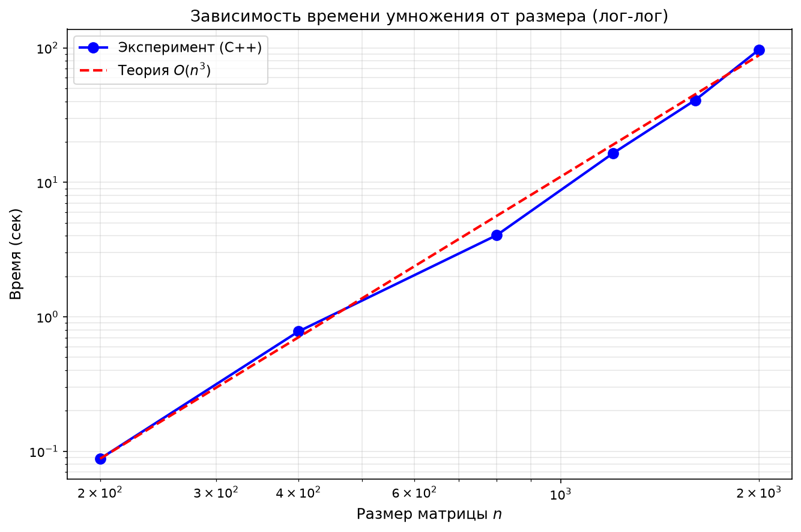
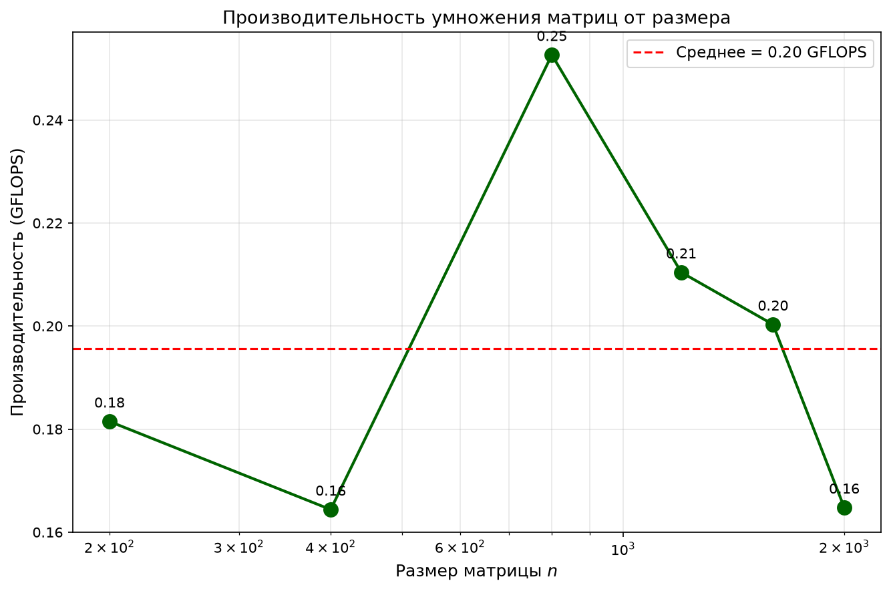
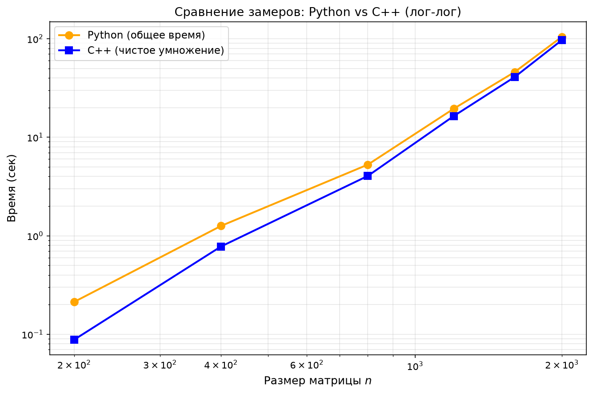

Лабораторная работа по параллельному программированию №1.
Выполнено Кирсановой Ириной, 6212-100503D.

***
# Структура проекта

```
lab1/
├── .gitignore
├── README.md
│
├── data/                          # исходные матрицы (txt)
│   ├── matrix_a_200.txt
│   ├── matrix_b_200.txt
│   └── ...
│
├── results/                       # результаты умножения (txt)
│   ├── result_200.txt
│   └── ...
│
├── run_results/                   # результаты экспериментов
│   ├── timings.csv                # данные запусков
│   ├── graph1_loglog.png          # лог-лог график
│   ├── graph2_performance.png     # производительность (GFLOPS)
│   └── graph3_compare.png         # сравнение времени
│
├── generator.py                   # генератор матриц
├── main.cpp                       # умножение матриц на C++
├── run.py                         # запуск и проверка точности через NumPy
├── grafs.py                       # построение графиков
└── table.py                       # генерация таблицы для отчёта
```

***
# **Характеристики:**

- **CPU**:  AMD Ryzen 7 H 255

- **Оперативная память**:  16 гб DDR5 5600 MHz

- **Накопитель**:  SSD 1024 гб

- **ОС**:  Windows 11 Pro, 64-bit

- **Компилятор C++**:  MSVC (Microsoft Visual C++) Version 19.51.36260 for x64

- **Python**:  3.14.7
***

# **Суть работы:**

Написать программу на языке C/C++ для перемножения двух квадратных матриц. Провести эксперименты для разных размеров матриц, дополнив отчёт таблицей и графиком.
При данных матрицах A и B ∈ $R^{n×n}$ вычислить матрицу C, которая будет вычисляться по формуле:
$$C_{ij} = \sum_{k=1}^{n} A_{ik} \cdot B_{kj}$$

***

# **Порядок проведения экспериментов**

1.  Сгенерировать две матрицы размером n×n (200, 400, 800, 1200, 1600, 2000) с помощью скрипта generator.py, записать в два файла формата txt.
2.  Запустить скрипт run.py, которая сделает по 3 запуска на размер основной программы main.cpp. и на каждом запуске пустит таймер, который в конце покажет, сколько времени ушло на выполнение всей программы (в том числе на чтение файлов и тд).
3. main.cpp прочитает матрицы из файлов и перемножит их, запишет результат в txt файл, который будет храниться в папке results, также запустит таймер, который засечёт, сколько времени уходит на выполнение алгоритма. Также программу можно запустить отдельно командой `.\main.exe (размер матрицы)`, а не через скрипт, в таком случае она произведёт расчёт только для заданного размера и в терминале выведет время выполнения алгоритма, количество операций (по формуле $2n^3$), адрес файла с результатом.
4.  Numpy также посчитает произведение матриц, и полученный результат будет сравниваться с результатом выполнения main. Посчитается абсолютная разница(1) и относительная погрешность(2) по формулам:  $$\Delta_{ij} = |C_{cpp}[i][j] - C_{numpy}[i][j]| \quad(1)$$

и $$\delta_{ij} = \frac{|C_{\text{cpp}}[i][j] - C_{\text{numpy}}[i][j]|}{\max(|C_{\text{numpy}}[i][j]|, 1)} \quad(2)$$ соответственно. Все отчёты будут выведены в терминал и записаны в файл timings.csv (папка run_results).

---

# **Результаты экспериментов**

| Размер | Время Python (сек) | Время C++ (сек) | Операций | Нс/операцию | Проверка |
|---|---|---|---|---|---|
| 200 | 0.2133 | 0.088161 | 16 000 000 | 5.5101 | OK |
| 400 | 1.2593 | 0.778649 | 128 000 000 | 6.0832 | OK |
| 800 | 5.2782 | 4.053068 | 1 024 000 000 | 3.9581 | OK |
| 1200 | 19.4988 | 16.422968 | 3 456 000 000 | 4.7520 | OK |
| 1600 | 45.9633 | 40.897202 | 8 192 000 000 | 4.9923 | OK |
| 2000 | 104.8371 | 97.097496 | 16 000 000 000 | 6.0686 | OK |

P.s. Нс/операцию — среднее время, затрачиваемое на одну арифметическую операцию (умножение или сложение).

`Создано скриптом table.py`
## Лог-лог график: время vs размер



На графике видно, что экспериментальные точки хорошо ложатся на теоретическую 
кривую $O(n^3)$.  Наклон кривой в лог-лог масштабе ≈ 3, что совпадает с теоретической оценкой.

## Производительность



Пик достигается при n=800 (данные помещаются в кэш процессора), после чего наблюдается снижение — для больших размеров данные не влезают в кэш, и вычисления начинают ограничиваться пропускной способностью оперативной памяти.

## Сравнение Python и C++


Разрыв между общим временем работы и чистым временем 
умножения объясняется накладными расходами на чтение/запись файлов и запуск 
процесса. Для больших матриц разрыв сокращается, так как основное время 
начинает занимать само умножение.

`Создано скриптом grafs.py`
***
# **Выводы**

- **Программа работает корректно**, при автоматической проверке скрипт run.py выдал максимальную абсолютную погрешность 0 (это объясняется тем, что обе реализации используют целочисленную арифметику, где нет потерь точности).
- **Сложность алгоритма**: O($n^3$)
- **Объём задачи**: $2n^3$
- **Задача умножения матриц размера 1600×1600 и 2000×2000 требует значительных вычислительных ресурсов**: количество операций достигает 1.6×10¹⁰, что приводит к длительной работе программы. Наблюдалась активная работа системы охлаждения, что также говорит о высокой вычислительной нагрузке задачи.
-  **При увеличении размера в 2 раза время растёт в ~8 раз** (для 200→400: 8.8×; для 400→800: 5.2×).  Для больших размеров рост замедляется из-за кэш-эффектов, но асимптотика сохраняется.
***
# Сборка и запуск

```bash
# 1. Сгенерировать матрицы
python generator.py

# 2. Собрать
cl /EHsc /utf-8 /std:c++23preview /O2 main.cpp

# 3. Запустить скрипт из корня проекта
python run.py

# 4. Построить графики
python grafs.py

# 5. Сгенерировать таблицу для отчёта
python table.py
```
